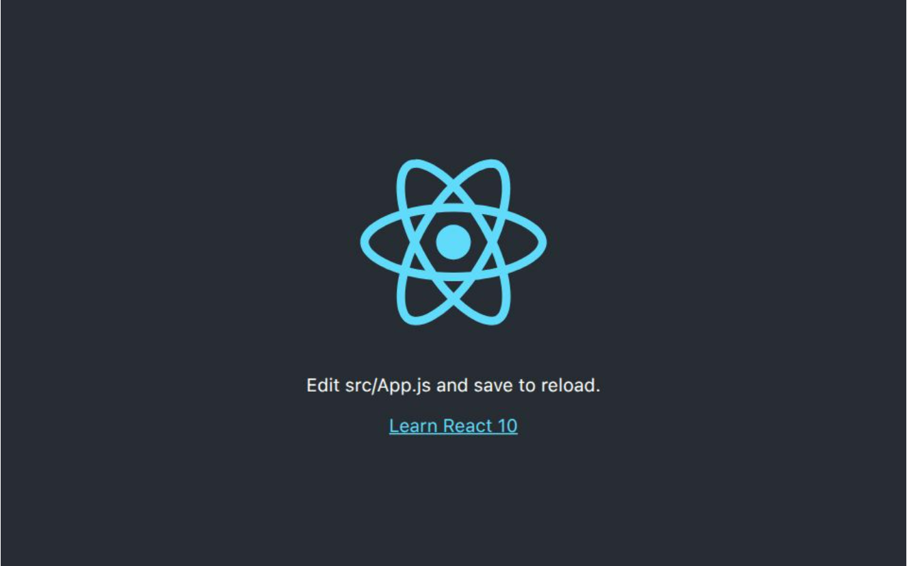

## react-vercel
- Runtime/framework: react
- Deployment: Vercel

## features
- Natively supported by vercel. Dont need vercel config file. Just deploy it to vercel

## To have continuous deployment on vercel
- Vercel project > `Settings` > `Git` > connect github repo
- Vercel project > `Settings` > `Builds and Deployment` > `Root Directory` > add subdirectory name
- Vercel project > `Deployments` > three dots > `Create Deployment` > click on branch name

## Vercel url
- https://serverless-vercel-configurations-10.vercel.app/
- 
- (check for vercel updates if the website goes down)