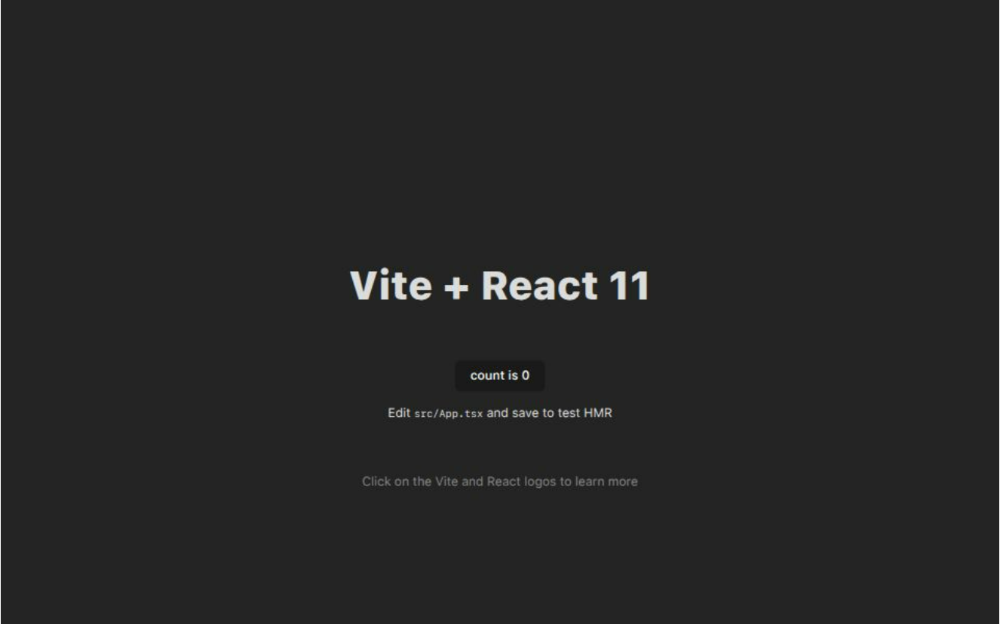

# Integrating client and backend without proxy

- serving client via backend using express.static()
- works in production, but have to build client everytime we make changes to client
- deploy only server

- dont forget to export module app or serevr in server/index.js for vercel

## Process

1. Enter the folder
2. Run `npx create vite@latest` and set folder any frontend name (eg: client)
3. Create server folder with routes and starting point file (eg: index.js). Make sure to export the app or server in index.js for the sake of vercel serverless deployment
4. In client/vite.config.ts, add
   ```js
   build: {
       outDir: 'build',
       emptyOutDir: true, // also necessary
   }
   ```
5. serve cient from serevr as `server.use(express.static(path.resolve(__dirname, "../client/build")));`
6. Create vercel.json file outside client and server folders
7. Run `vercel`

## To have continuous deployment on vercel
- Vercel project > `Settings` > `Git` > connect github repo
- Vercel project > `Settings` > `Builds and Deployment` > `Root Directory` > add subdirectory name
- Vercel project > `Deployments` > three dots > `Create Deployment` > click on branch name

## Vercel url
- https://serverless-vercel-configurations-11.vercel.app/
- 
- (check for vercel updates if the website goes down)